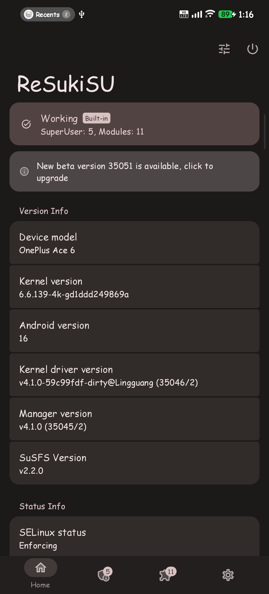
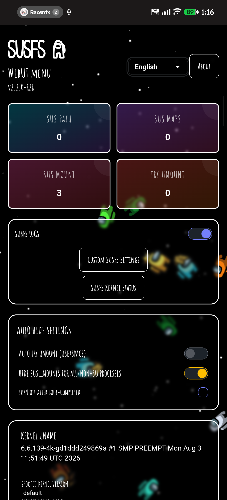
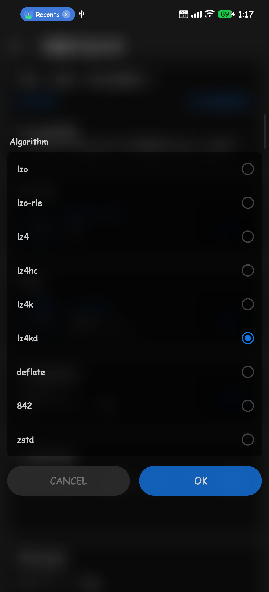
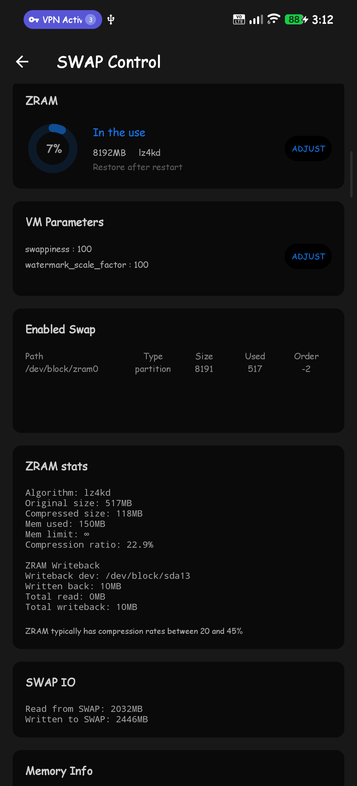
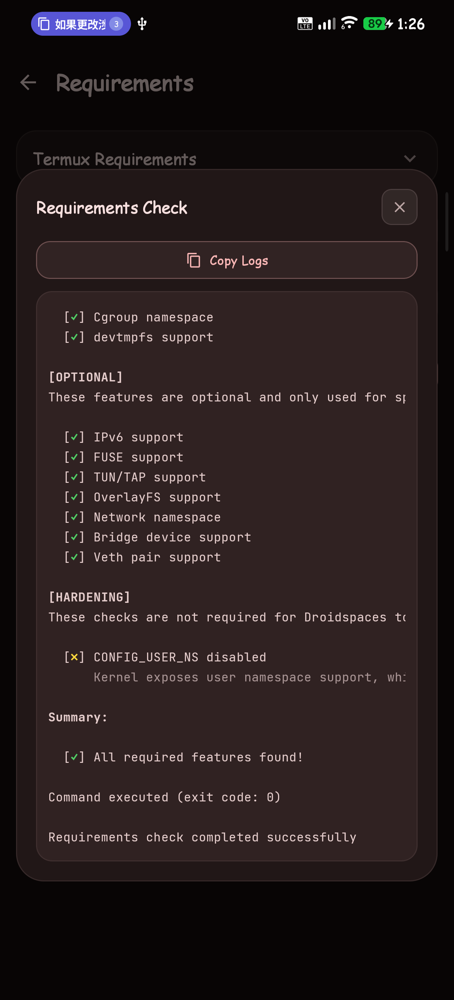
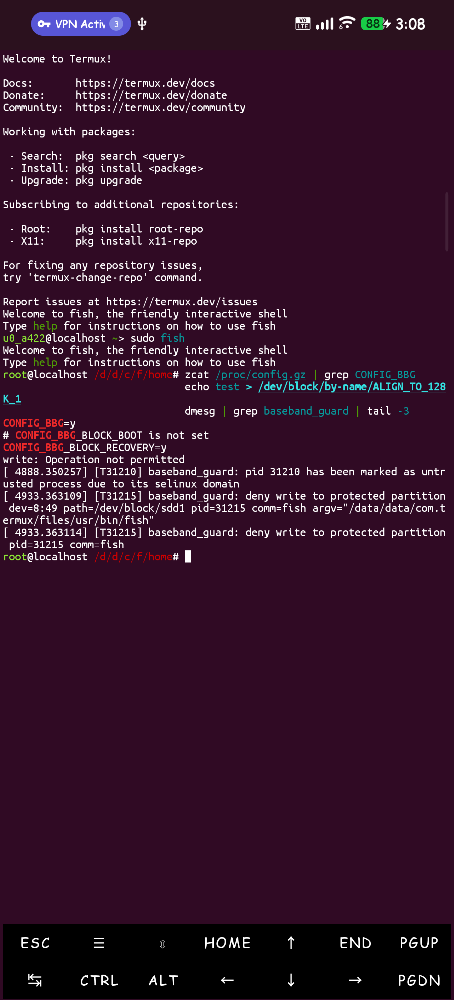
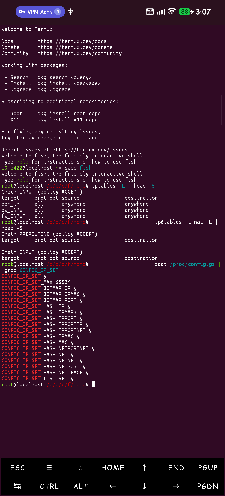
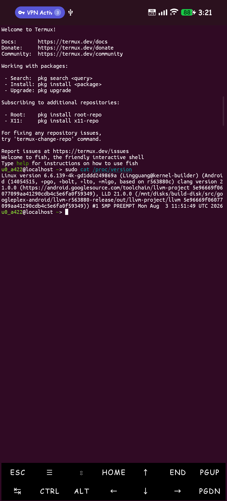
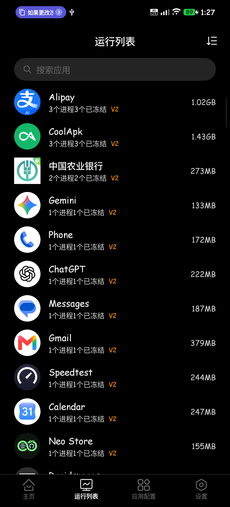
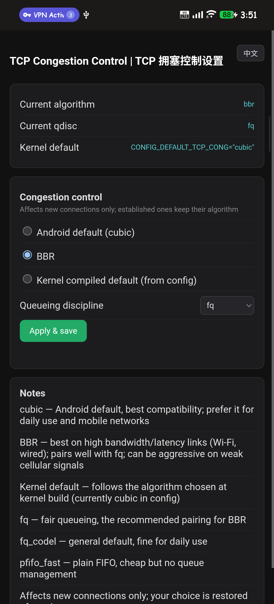

# OnePlus Ace 6 Kernel Builder

> **English** | [中文（简体）](README_zh.md)

> OnePlus Ace 6 / 15R (ktm, SM8750) custom kernel builder — configurable GitHub Actions build with ReSukiSU + SUSFS + Droidspaces + Re:Kernel support, verified on Project Infinity X (Android 16).


---

## 📖 Table of Contents

- [Overview](#overview)
- [Repository at a glance](#repository-at-a-glance)
- [Features](#features)
- [Feature details](#feature-details)
- [Verified evidence](#verified-evidence)
- [On-device screenshots](#on-device-screenshots)
- [How to use](#how-to-use)
- [Flashing disclaimer](#flashing-disclaimer-read-this-or-regret-it)
- [Platform compatibility](#platform-compatibility)
- [Adaptations](#adaptations)
- [Reproducibility](#reproducibility)
- [Local build](#local-build)
- [Repository layout](#repository-layout)
- [Customizations](docs/CUSTOMIZATIONS.md)
- [Roadmap & help wanted](#roadmap--help-wanted)
- [Credits](#credits)
- [License](#license)

---

## Overview

Builds a custom kernel for the **SM8750 (Snapdragon 8 Elite) platform** — primarily **OnePlus Ace 6 / 15R** (codename `ktm`), running **Project Infinity X** (LineageOS-based, Android 16, kernel 6.6.139).

> ⚠️ **Only tested on Project Infinity X** — NOT for ColorOS/OxygenOS. Probably works on LineageOS (Ace6). See the [disclaimer](#flashing-disclaimer-read-this-or-regret-it).

> 💡 **What this repo is**: looking for the kernel source? CI pulls it fresh from upstream `lineage-23.2` on every build. This repo keeps the delta — the patches, the extra C sources, the workflows — and the flashable result lands in [Releases](https://github.com/GuLingguang/oneplus-sm8750-kernel-pro-build/releases).

Every feature is an **optional toggle** in GitHub Actions — build exactly what you need, nothing more.

The kernel is built from the **official Ace6 kernel source** (lineage-23.2 branch), with **official prebuilt vendor modules** (from the ROM's vendor_dlkm), which means:

- No need to rebuild the entire module tree (UFS/GPU/etc. come from the ROM)
- The device accepts kernels with a **real commit-based version string** — we faked the vermagic first, then stopped, and the device never cared (details in [Verified evidence](#verified-evidence))

## Repository at a glance

| | What |
|---|---|
| **10 feature patches** | **29,162 lines** of adaptation against the lineage-23.2 tree |
| **extra C sources** | **20,775 lines** — susfs.c, EVDI driver, lz4/lz4kd/zstd libraries, ntsync, Baseband-guard |
| **API adaptations** | **16 total** — 11 SUSFS (new KSU API) + 5 Re:Kernel (lineage 6.6.139 signatures) |
| **CI design** | 32 steps, 24 inputs, fingerprint ccache — ~8 min full build |
| **Verified on device** | **567 official ROM modules** load & run; vendor partitions EROFS read-only |
| **Maintenance** | no fork tree to keep in sync — the delta is 10 patches + extra sources, applied on demand against upstream `lineage-23.2` |

---

## ⚠️ Flashing disclaimer

> [!WARNING]
> This kernel was tested on **one device with one ROM** — please read before flashing.

### Compatibility

| ROM | Status |
|---|---|
| **Project Infinity X** (v3.12, Android 16) | ✅ Tested & working (OnePlus Ace 6 / 15R `ktm`) |
| **LineageOS** (Ace6 builds) | 🤔 Probably works — the kernel/modules/devicetrees are stock LineageOS with only non-destructive Ace6 additions (MPC7022 gauge, TMS NFC), but **not yet confirmed on a real device** |
| **ColorOS / OxygenOS** | ❌ **Not supported** — likely won't boot (different vendor integration) |
| Anything else | 🏴☠️ Unknown territory |

### Before you flash

1. **Back up your boot partition** — you will thank yourself later
2. **This kernel touches the `boot` partition only** — do not flash anything else (the device is already fused; messing with other partitions can brick it)
3. **Your device must run a LineageOS-based ROM** (like Infinity X) — this won't work on stock ColorOS/OxygenOS
4. This is a **community project** — there's no warranty, no support hotline, and no refunds

### If it bootloops

- Stay calm (or don't, we don't judge)
- Restore your stock boot image (that's why you backed up!)
- The stock `boot.img` is also extractable from the original ROM zip (`payload.bin`)

> [!CAUTION]
> **Only tested on Project Infinity X.** LineageOS is *probably* fine, ColorOS/OxygenOS is *probably* not. If in doubt, back up first and flash at your own risk.

## Platform compatibility

### SM8750 platform

This project targets the **SM8750 (Snapdragon 8 Elite) platform** — the kernel, modules, and devicetree sources are all stock lineage-23.2 trees for the platform. The short ROM compatibility table lives in the [disclaimer](#flashing-disclaimer-read-this-or-regret-it); the long version is one paragraph:

- The `lineage-23.2` SM8750 tree family is **shared across devices** — the same kernel/module/dtb trees underpin Ace6, other OnePlus SM8750 devices, and their LOS-based ROMs. What differs per device is the **vendor integration** (device-specific modules and firmware), so a kernel that boots one device may still refuse another.
- **Other OnePlus SM8750 devices** (if they use this tree family): 🧪 probably works, **completely unverified** — test at your own risk, back up first.

## Verified evidence

Measured on **OnePlus Ace 6 / 15R (`ktm`), Project Infinity X v3.12** (2026-08-03). Every row below was observed on the device:

| What | Evidence |
|---|---|
| **Kernel version** | `6.6.139-4k-g<12-digit-commit>` — real upstream commit in LOCALVERSION |
| **Official ROM modules** | All **567** vendor modules (`vendor_dlkm`) load and run under the custom kernel. The ROM's modules carry a different version string (`-gdc4c44f3ecc0-dirty`) — it never mattered, MODVERSIONS symbol checking is what the device enforces |
| **ReSukiSU** | v4.1.0 (build **35046**) — connects to KernelSU Manager |
| **zram compressors** | `lz4kd` visible in `comp_algorithm` (zram is compiled in — the ROM's prebuilt `zram.ko` was the stale one masking the list); full algorithm list with `show_all_algos` |
| **Vendor read-only** | `/vendor`, `/vendor_dlkm`, `/odm`, `/system_dlkm` all EROFS; write attempts rejected |

Honest gaps (also from the same session):

- **Re:Kernel** runtime is now verified via NoActive (see [On-device screenshots](#on-device-screenshots)); it runs in source-patch mode, not LKM
- **KPM/KPN** implements the toolchain hooks; not exercised on a real device yet
- **LineageOS** (official Ace6 builds) is *expected* to work (identical trees), **not confirmed** — the test device runs Project Infinity X

## On-device screenshots

Taken on the same test device (OnePlus Ace 6 / 15R `ktm`, Project Infinity X v3.12). Click any thumbnail for the full-resolution image.

<table>
  <tr>
    <td align="center"><a href="docs/screenshots/ksu_manager.png"></a></td>
    <td align="center"><a href="docs/screenshots/susfs.png"></a></td>
    <td align="center"><a href="docs/screenshots/zram_all_algos.png"></a></td>
    <td align="center"><a href="docs/screenshots/zram_writeback.png"></a></td>
    <td align="center"><a href="docs/screenshots/droidspaces.png"></a></td>
  </tr>
  <tr>
    <td align="center"><b>① ReSukiSU</b></td>
    <td align="center"><b>② SuSFS</b></td>
    <td align="center"><b>③ Zram algorithms</b></td>
    <td align="center"><b>④ LZ4KD + writeback</b></td>
    <td align="center"><b>⑤ Droidspaces</b></td>
  </tr>
  <tr>
    <td align="center"><a href="docs/screenshots/bbg_erofs.png"></a></td>
    <td align="center"><a href="docs/screenshots/network.png"></a></td>
    <td align="center"><a href="docs/screenshots/banner.png"></a></td>
    <td align="center"><a href="docs/screenshots/rekernel.png"></a></td>
    <td align="center"><a href="docs/screenshots/bbr.png"></a></td>
  </tr>
  <tr>
    <td align="center"><b>⑥ Baseband Guard</b></td>
    <td align="center"><b>⑦ Better network</b></td>
    <td align="center"><b>⑧ Build tags</b></td>
    <td align="center"><b>⑨ Re:Kernel</b></td>
    <td align="center"><b>⑩ BBR</b></td>
  </tr>
</table>

Still pending: **KPM/KPN** (not tested on device yet).

---

## Features

| Feature | Default | Description |
|---|---|---|
| 🔗 **KernelSU** | `none` | ReSukiSU (built-in KSU) or none |
| 🛡️ **SUSFS** | off | Enhanced mount/root hiding (needs KSU) |
| ⚡ **lz4 1.10 + zstd 1.5.7** | off | Compression performance (newer algorithms, ARM64 NEON) |
| ⚡ **LZ4KD** | off | Additional lz4 variant for zram |
| 🧪 **All zram algorithms** | off | Enable every zram compressor in `comp_algorithm` (lz4hc/842 too; handy for container/Droidspaces scenarios) |
| 🛡️ **ZRAM writeback** | off | Write idle/incompressible zram pages to a backing device (needs runtime `backing_dev` config) |
| 📦 **Droidspaces** | off | Lightweight Linux container support (standard/extend) |
| 🛡️ **Baseband Guard** | off | Kernel-level anti-format protection |
| 🔒 **CVE patches** | off | GhostLock (CVE-2026-43499 + CVE-2026-53163) |
| 🌐 **Better network** | off | ipset/iptables advanced network support |
| 🚀 **BBR** | off | TCP congestion control |
| 🧩 **KPM/KPN** | off | KernelPatch Next (independent kernel patch support) |
| 🔗 **Re:Kernel** | off | Freezer/NoActive binder notification hooks |
| 🏷️ **Kernel suffix** | empty | Custom version suffix (e.g. `perf` → `6.6.139-4k-perf`) |
| ✍️ **Attribution** | on | Build tags (user/host/REPO_NAME/AK3) |
| 📦 **Artifacts** | ak3 | `ak3` (flashable zip) or `all` (ak3 + Image + boot.img) |
| 🕐 **Build time** | empty | Custom build timestamp (`KBUILD_BUILD_TIMESTAMP`). On CI all build timestamps are fixed to `2025-05-25` via faketime for reproducibility — a custom value overrides the kernel-embedded one. Locally (reproduce.sh) empty = current UTC |
| 💾 **Public ccache** | off | Upload build cache to Release for fast rebuilds |
| 🔍 **ccache debug** | off | Upload ccache logs |

---

## Feature details

### 🔗 KernelSU (ReSukiSU)

- Clones [ReSukiSU](https://github.com/ReSukiSU/ReSukiSU) (full history — version number = `30000 + commit count + 700`)
- Applies the 7 mandatory manual hooks (execveat/stat/faccessat/sys_read/sys_reboot/input/setresuid)
- Verified with version 35046 (`v4.1.0`)

### 🛡️ SUSFS

- From [simonpunk/susfs4ksu](https://gitlab.com/simonpunk/susfs4ksu) (`gki-android15-6.6` branch)
- 25 main-tree files + 16 KernelSU-internal adaptation files
- Includes all susfs features: sus_path, sus_mount, sus_kstat, uname spoofing, cmdline spoofing, open_redirect, sus_map, AVC log spoofing

### 📦 Droidspaces

- `standard`: containers + ntsync (NT synchronization primitives)
- `extend`: + EVDI virtual display, virtual HCI, systemd-coredump
- Kernel configs: PID_NS/USER_NS/SYSVIPC/DEVTMPFS/POSIX_MQUEUE/namespaces

### 🔗 Re:Kernel

- **Source integration**: netlink server + binder hooks (reply/transaction/free_buffer_full) + signal hooks — the LKM route was tried first and dropped (this tree doesn't expose the hooks it needs)
- All wrapped in `#ifdef CONFIG_REKERNEL` — zero impact when disabled
- Adapted for the `lineage-23.2` tree (6.6.139): `proc_ops` API, different `binder_alloc`/`signal.c` signatures

### 🛡️ Baseband Guard

- From [cctv18/Baseband-guard](https://github.com/cctv18/Baseband-guard)
- LSM-based anti-format protection (blocks writes to non-user partitions)

### 🔒 GhostLock (CVE-2026-43499 + CVE-2026-53163)

Both vulnerabilities are covered:
- **CVE-2026-43499**: rtmutex `remove_waiter` NULL guard — already present in the upstream 6.6.139 tree (`scoped_guard`)
- **CVE-2026-53163**: proxy cleanup `ret < 0` fix in `rtmutex_api.c`

### ⚡ Compression

- lz4 1.10 (new library structure, ARM64 NEON fast decompress)
- zstd 1.5.7
- LZ4KD (from [ShirkNeko/SukiSU_patch](https://github.com/ShirkNeko/SukiSU_patch)) — independent algorithm for zram

---

## How to use

1. **Fork** this repository
2. Go to **Actions** → **Build Ace6 Kernel** → **Run workflow**
3. Toggle features as desired, click **Run workflow**
4. Download the AK3 zip from the run **artifacts** (or Release if `release_enable` is on)

### Toolchain

- Uses **AOSP Clang 21.0.0 (r563880c)** — the exact same toolchain as the official OnePlus kernel build (from the `AOSP-Clang-21.0.0-r563880c` Release of this repo)
- clang-21 installed via apt.llvm.org, or downloaded from the Release asset

### Notes

- Default workflow is a **minimal build** (no KSU, no features) — enable what you need
- `kernel_suffix` and `build_time` allow reproducible, identifiable builds
- Attribution defaults to `Lingguang@kernel-builder` — change via `build_user`/`build_host`, or disable entirely with `attribution_enable`

---

## Adaptations

This project adapts patches from several sources (primarily the [cctv18/oppo_oplus_realme_sm8750](https://github.com/cctv18/oppo_oplus_realme_sm8750) project, which targets the OnePlus official OKI tree) to the **Ace6 kernel tree** (`lineage-23.2`, kernel 6.6.139). Key adaptations:

- **Patches** are split into independent toggles (`patches/split/00-09`): `07_compile_fixes.patch` applies unconditionally, the rest are gated by workflow features (KSU/SUSFS/lz4/LZ4KD/Droidspaces/BBG/CVE/Re:Kernel)
- **New files** (that patches can't create) live in `patches/extra/` — lz4/zstd libs, susfs.c, evdi, ntsync, Baseband-guard
- **Re:Kernel** uses source hooks (netlink + binder/signal) adapted to the lineage-6.6.139 API
- **Modules** come from the ROM's official prebuilt `vendor_dlkm` — no need to rebuild the module tree
- Some OnePlus-official-only features (Fengchi scx governor, ADIOS IO scheduler) are **not ported** — their source exists only in the official OKI tree

## Reproducibility

- **Real commit** in LOCALVERSION (from GitHub API, since source is a zip without .git)
- **`KBUILD_BUILD_TIMESTAMP`** for custom/fixed build time
- **ccache** with sloppiness config (file mtime/ctime ignored) for fast rebuilds
- **Public ccache** (optional `ccache_update`): packages and uploads the cache to a Release for near-instant rebuilds
- **Upstream drift check**: `check_upstream.sh` (also a weekly workflow) dry-runs all 10 patches against the latest `lineage-23.2` tree — drift surfaces as a review-request issue, ahead of it surfacing as a bootloop
- Verified: GitHub Actions produces a bootable AK3 with the exact configured features

**GitHub free-tier reality check**: Actions gives 2,000 min/month and 1 GB of caches; this repo's ccache Release asset is ~630 MB and the toolchain asset ~1.5 GB. They make repeat builds fast, but they also churn your quota. For heavy or repeated local work, `reproduce.sh` is the free path — CI is the convenient one.

---

## Local build

The repo includes a **cross-machine local build script** — `reproduce.sh`:

```bash
./reproduce.sh                          # minimal build (no features)
./reproduce.sh --ksu resukisu --susfs   # with ReSukiSU + SUSFS
./reproduce.sh --rekernel --bbg --lz4   # more features
```

It auto-detects clang 21 (multiple paths), downloads sources (or uses `KERNEL_SRC`), applies patches by toggle, copies extra files, sets the real commit, and produces an AK3 zip. See `./reproduce.sh --help`.

**Requirements**: clang 21 (Arch: `pacman -S clang21 lld21 llvm21`; Ubuntu: apt.llvm.org; Fedora: `dnf install clang lld`), git, patch, unzip, zip, curl, make. The script detects your distro from `/etc/os-release` and prints the right install command if clang 21 is missing.

**Directory hygiene**: all intermediates (sources, patched tree, AK3 pack dir) live in `work/`; only the final flashable zip is written to `out/`. `./reproduce.sh --clean` wipes `work/` for a fresh rebuild. Nothing is scattered in the repo root.

---

## Repository layout

```
├── .github/
│   ├── ISSUE_TEMPLATE/
│   │   └── bug_report.md       # Bug template: ROM, toggles, logs
│   └── workflows/
│       ├── build.yml           # Main build workflow (manual trigger, 24 inputs)
│       ├── clean-ccache.yml    # Manual: purge GitHub caches / Release ccache assets
│       ├── upstream-check.yml  # Weekly: do the patches still apply upstream?
│       └── upload-toolchain.yml # One-time: upload AOSP clang to Release
├── patches/
│   ├── split/                  # 10 independent feature patches (00-09)
│   ├── extra/                  # New files patches can't create
│   │   ├── fs/  crypto/  drivers/  include/  lib/
│   │   │                       # susfs.c, evdi, ntsync, lz4/lz4kd/zstd, headers
│   │   └── Baseband-guard/     # Anti-format LSM
│   └── 02_ksu.patch            # SUSFS KernelSU-internal adaptation
├── config/
│   └── config_ace6_final.config  # Base kernel config (from the device)
├── docs/
│   └── CUSTOMIZATIONS.md         # Our on-device modifications (EN + 中文)
├── modules/
│   ├── azram-backing/            # KSU module: hybridswap backing at boot (runs first)
│   ├── selinux_perf/             # KSU module: quiet perf-HAL SELinux denials
│   └── tcp-config/               # KSU module: TCP algo/qdisc WebUI + nc fallback
├── ak3/                        # AnyKernel3 template (tools/, META-INF/)
├── lib/                        # faketime libs + ccache-ECS
├── LICENSE
├── check_upstream.sh           # Drift check: dry-run all patches on latest tree
└── reproduce.sh                # Local build script
```

---

## Roadmap & help wanted

The builder itself is **complete and verified on one device** — the gaps below are the real ones. Every item is a concrete way to help, no kernel expertise required for most:

**Looking for testers** — especially anyone on official LineageOS (Ace6): one confirmation report would close the biggest open question below.

| Item | Status | How to help |
|---|---|---|
| **Re:Kernel runtime verification** | ✅ verified via NoActive (source-patch mode) | — |
| **KPM/KPN on-device test** | ⏳ toolchain ready, not exercised | load a KPM module, report what works/breaks |
| **LineageOS (Ace6) confirmation** | 🤔 expected to work, unconfirmed | flash on official LineageOS, open an issue with the [bug template](.github/ISSUE_TEMPLATE/bug_report.md) |
| **Other SM8750 devices** | 🧪 same tree family, unverified | test at your own risk — back up `boot` first |

**Maintenance commitment**: the author follows upstream `lineage-23.2` and ReSukiSU changes — when the trees drift and a patch breaks, `reproduce.sh` fails loudly at apply time; open an issue and it gets adapted.

**Discussions**: issue reports are the primary channel — for everything else (feature requests, "does it work on my ROM?"), open an issue and label it. If there's enough traffic, Discussions get enabled. See [CONTRIBUTING.md](CONTRIBUTING.md) for what makes a report or PR useful.

**Versions**: Release tags follow `kernel-<timestamp>-<feature-flags>` (e.g. `kernel-20260803-115320-ksu35046`) — point-in-time snapshots of whatever was built that run. There is no upgrade-path promise yet; the tag is a record, and the flashable zip is the deliverable.

---

## Credits

This project builds upon the work of many projects and developers. Thank you!

### 🏆 Primary inspiration & patch sources

| Project | Used for |
|---|---|
| [cctv18/oppo_oplus_realme_sm8750](https://github.com/cctv18/oppo_oplus_realme_sm8750) | **Primary reference** — workflow design, patch structure, lz4/zstd/Droidspaces/BBG integration, ccache-ECS, faketime |
| [Ace6-Development/android_kernel_oneplus_sm8750](https://github.com/Ace6-Development/android_kernel_oneplus_sm8750) | Kernel source (lineage-23.2) |
| [Ace6-Development/android_kernel_oneplus_sm8750-modules](https://github.com/Ace6-Development/android_kernel_oneplus_sm8750-modules) | Module source (symbol link targets) |
| [LineageOS/android_kernel_oneplus_sm8750-devicetrees](https://github.com/LineageOS/android_kernel_oneplus_sm8750-devicetrees) | Device tree source |

### 🧩 Feature sources

| Project | Used for |
|---|---|
| [ReSukiSU/ReSukiSU](https://github.com/ReSukiSU/ReSukiSU) | KernelSU implementation |
| [simonpunk/susfs4ksu](https://gitlab.com/simonpunk/susfs4ksu) | SUSFS kernel patches |
| [ShirkNeko/susfs4ksu](https://github.com/ShirkNeko/susfs4ksu) | SUSFS mirror |
| [Sakion-Team/Re-Kernel](https://github.com/Sakion-Team/Re-Kernel) | Re:Kernel source hooks |
| [KernelSU-Next/KPatch-Next](https://github.com/KernelSU-Next/KPatch-Next) | KPM/KPN toolchain |
| [ShirkNeko/SukiSU_patch](https://github.com/ShirkNeko/SukiSU_patch) | LZ4KD algorithm |
| [cctv18/Baseband-guard](https://github.com/cctv18/Baseband-guard) | Anti-format LSM |
| [ravindu644/Droidspaces-OSS](https://github.com/ravindu644/Droidspaces-OSS) | Droidspaces container |
| [zzh20188/GKI_KernelSU_SUSFS](https://github.com/zzh20188/GKI_KernelSU_SUSFS) | GhostLock CVE chain, build time, reference |

### 🛠️ Tools & infrastructure

| Project | Used for |
|---|---|
| [Android AOSP clang prebuilts](https://android.googlesource.com/platform/prebuilts/clang/host/linux-x86) | Official toolchain (r563880c) |
| [osm0sis/AnyKernel3](https://github.com/osm0sis/AnyKernel3) | AK3 flashable zip template |
| [cctv18/ccache-ECS](https://github.com/cctv18/ccache-ECS) | Specialized kernel build cache |
| [ferstar/lz4-zstd](https://github.com/ferstar) | lz4/zstd algorithm updates (via cctv18) |
| [Xiaomichael](https://github.com/Xiaomichael) | lz4/zstd porting (via cctv18) |

### 🙏 Special thanks

- [**@cctv18**](https://github.com/cctv18) — the entire build pipeline concept, patch integration, and ccache optimization approach
- [**@NullCode1337**](https://github.com/NullCode1337) — the Project Infinity X ROM and Ace6 kernel development
- **All upstream kernel/Android projects** that make custom kernels possible

---

## License

[GPL-2.0](LICENSE)
